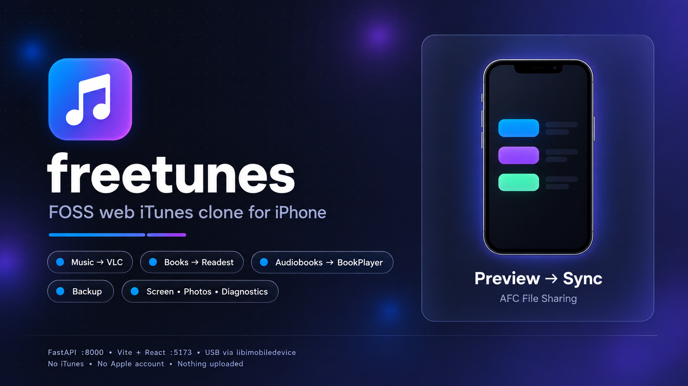

# freetunes — FOSS web iTunes clone (Finder + Music UI)

[](backend/requirements.txt)
[](backend/app/main.py)
[](frontend/package.json)
[](frontend/package.json)
[](docs/COMPATIBILITY.md)
[](Makefile)

Manage iPhone media from your browser — **no iTunes, no Apple account, nothing uploaded**.
freetunes runs entirely on your own computer: plug in over USB, then copy
music, ebooks and audiobooks into free open-source player apps via
Apple File Sharing (AFC), back up the whole phone, browse files and photos,
watch the screen live, and check device health.

> Apple doesn't let third parties write into its own Music / Books apps.
> freetunes uses the open door Apple does allow: handing files to other apps.

| Library | Plays in | App |
|---|---|---|
| Music | [VLC for iOS](https://github.com/videolan/vlc-ios) | `org.videolan.vlc-ios` |
| Ebooks | [Readest](https://github.com/readest/readest) | File Sharing inbox |
| Audiobooks | [BookPlayer](https://github.com/TortugaPower/BookPlayer) | File Sharing inbox |

## Features

| Area | What you get |
|---|---|
| 🎵 Music / 📚 Books / 🎧 Audiobooks | Library folder → **Preview** (green = copy, grey = already there) → **Sync**. SHA-256 dedupe, search, mirror-delete is off by default |
| 📱 Device | Live status banner (backend down / no iPhone / untrusted / connected + iOS), specs, storage bar (AFC `FSFreeBytes`, matches Settings), battery |
| 💾 Backup | Full + incremental via `idevicebackup2`, encryption toggle (passwords/health need it), verify, restore, delete |
| 🗂 Files & 📷 Photos | AFC Finder-style browser; DCIM export + delete; byte-identical duplicate groups |
| 🖥 Screen (3uTools-style) | Preview (USB screenshot polling 1–5 fps) · QuickTime USB (H.264 30–60 fps, no Developer Mode) · HD USB (iOS 27+) · AirPlay via managed `uxplay`. View-only + 📷 screenshot button |
| 🩺 Diagnostics | Retail/refurb check, crash reports (`.ips`, newest first), live `syslog` tail with level filters + keyword guide |
| 🧰 Toolbox & Firmware | Tags, duplicates, ringtone maker (≤ 40 s), format conversion, photo compress, HEIC → JPG · signed-IPSW list only, always dry-run, never flashes |
| 🎨 Appearance | Light / Dark / Automatic + accent color, glassmorphism, remembered per computer. In-app offline user guide (Documentation tab) |

## Quickstart

```bash
make setup       # first time only: backend .venv + frontend deps
make dev         # backend :8000 + UI :5173, both live-reload on save
# open http://127.0.0.1:5173, set library path, Preview -> Sync
```

1. Plug in your iPhone, unlock it, tap **Trust**.
2. Install VLC / Readest / BookPlayer on the phone (open each once).
3. In freetunes pick **Music / Books / Audiobooks**, paste your library folder, **Preview → Sync**.

Need the plain-language version? Read **[docs/USER_GUIDE.md](docs/USER_GUIDE.md)**
(with jargon glossary). Contributing? See **[docs/DEVELOPER.md](docs/DEVELOPER.md)**
and **[docs/SYNC_MODEL.md](docs/SYNC_MODEL.md)**. Will it work with your
iPhone/iOS? See **[docs/COMPATIBILITY.md](docs/COMPATIBILITY.md)** — the honest,
sourced support list (libimobiledevice 1.4.0+ / git needed for iOS 17+).

## How it works

```
[iPhone USB] <-> [FastAPI daemon :8000, backend/] <-> [Vite + React SPA :5173, frontend/]
```

Browsers can't speak usbmuxd/AFC, so all USB work lives in the local Python
daemon; the SPA only talks HTTP to it. `FREETUNES_MOCK=1` forces an in-memory
AFC for UI work without a phone (`make dev FREETUNES_MOCK=1`).

## Layout

- `backend/` — FastAPI daemon on `http://127.0.0.1:8000` (USB/AFC, backup, screen, diagnostics)
- `frontend/` — Vite + React Finder-style UI on `http://127.0.0.1:5173`
- `shared/openapi-types.ts` — shared API shapes
- `scripts/dev.sh` — dev runner (tagged `[backend]` / `[frontend]` logs, no orphaned daemons)
- `docs/` — user guide, developer guide, compatibility, diagnostics, sync model + `banner.png`

## API

<details>
<summary>Endpoints (click to expand)</summary>

- `GET /health`, `GET /devices`, `GET /apps`, `GET /apps/{bundle}/files`
- `GET /library/music?path=…`, `GET /library/books?path=…`
- `POST /sync/preview`, `POST /sync/run` `{app_bundle_id, music_dir, mirror_delete, dry_run}`
- `GET /backup/{udid}`, `POST /backup/{udid}`, `GET /backup/{udid}/files`, `POST /backup/{udid}/encryption`, `POST /backup/{udid}/restore` (idevicebackup2; mock-safe stub when tool missing)
- `GET /files/browse?udid=&path=/`, `GET /photos?udid=`, `GET /photos/duplicates?udid=`, `DELETE /photos?udid=&path=/DCIM/….JPG`, `GET /storage/breakdown?udid=`
- `GET /diagnostics/verification|crashes|syslog?udid=` (logs & crash reports — see [docs/DIAGNOSTICS.md](docs/DIAGNOSTICS.md))
- `POST /tools/tags`, `GET /tools/duplicates?path=`, `POST /tools/ringtone|convert|compress-photo|heic-to-jpg`
- `GET /firmware/signed?product=iPhone14,5`, `POST /flash/dry-run` (signed-only, never flashes)
- `GET /screen/status|shot|stream`, `POST /screen/hd/start|stop`, `GET /screen/valeria`, `POST /screen/valeria/start|stop|install|usbmux-setup`, `POST /screen/airplay/start|stop` (3uTools-style realtime screen: HD HEVC over USB via pymobiledevice3, QuickTime-USB Valeria H.264 30–60 fps with no Developer Mode, MJPEG preview fallback, managed uxplay AirPlay; Linux USB setup via `make setup-valeria-linux`)
- `POST /screen/setup/reveal-developer-mode|enable-developer-mode|mount-ddi` (the iOS 17–26 prerequisites, driven from the Screen tab and the device page)

</details>

## Tests

```bash
make test        # backend pytest suite
make check       # pytest + frontend typecheck (tsc --noEmit)
make verify      # check + production build (the full gate)
make build       # frontend dist only
```

UI design is guarded by static contract tests in `backend/tests/`
(`test_design.py`, `test_hig.py`, `test_polish.py`): **tests first** —
add/adjust the contract, watch it fail, then implement.

## Safety notes

- **Preview never changes anything.** Sync only adds files; it never deletes
  from your iPhone unless you explicitly turn on mirror mode.
- Back up (Backup tab) before anything destructive; encrypt to include
  passwords and health data.
- Only copy files you own or that are freely licensed. DRM-protected store
  purchases won't play in VLC/Readest/BookPlayer.

## Sources

Built on open source — full list with licenses in the app footer
(`frontend/src/sources.ts`):

[VLC for iOS](https://github.com/videolan/vlc-ios) ·
[Readest](https://github.com/readest/readest) ·
[BookPlayer](https://github.com/TortugaPower/BookPlayer) ·
[libimobiledevice](https://github.com/libimobiledevice/libimobiledevice) ·
[ifuse](https://github.com/libimobiledevice/ifuse) ·
pymobiledevice3 · uxplay · device art: Rafael Fernandez (CC BY-SA 4.0, see `docs/COMPATIBILITY.md` §2)

## Roadmap

P0 scaffold ✅ → P1 real device layer (pymobiledevice3 AFC + idevicebackup2) →
P2 music polish → P3 books OPDS → P4 audiobook chapters → P5 backup UI.
